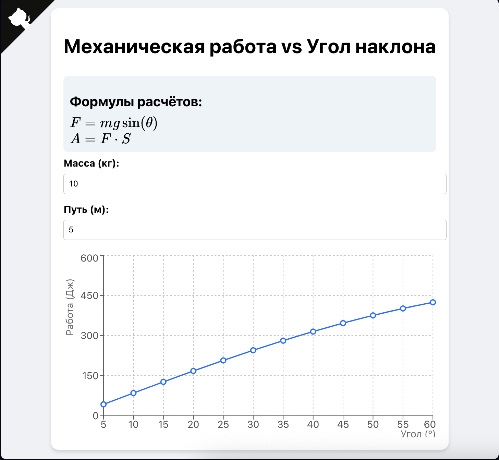

# ⚙️ Визуализатор механической работы

Интерактивное веб-приложение на React, которое помогает наглядно изучить, как зависит механическая работа от угла наклона поверхности. Подходит для школьников 7 класса, студентов и всех, кто интересуется физикой.

### 👉 [Перейти на веб-приложение](https://artew4.github.io/react-app/)


 <!-- сюда можешь вставить скриншот приложения -->

---

## 📐 Что делает приложение

🔹 Строит график зависимости механической работы от угла наклона поверхности.  
🔹 Позволяет задавать массу тела и путь.  
🔹 Отображает физические формулы, использованные в расчётах.  
🔹 Весь расчёт происходит в реальном времени — удобно для объяснения на уроке.

---

## 📊 Формулы, используемые в приложении

Механическая работа тела, скользящего по наклонной плоскости без трения, рассчитывается по формулам:


`F = m · g · sin(θ)`

`A = F · S`

Где:  
- \( F \) — сила, действующая вдоль наклонной  
- \( A \) — механическая работа  
- \( m \) — масса тела  
- \( g = 9.8 \, м/с^2 \) — ускорение свободного падения  
- \( \theta \) — угол наклона  
- \( S \) — путь (длина наклонной)  

---

## 🧮 Пример кода расчёта

Логика расчётов вынесена в файл [`physicsEngine.js`](./src/utils/physicsEngine.js):

```js
function calculateForce (mass, g = 9.8, theta = 90) {
  let radians = theta * Math.PI / 180;
  return mass * g * Math.sin(radians);
}

function calculateWork (force, distance) {
  return force * distance;
}
```